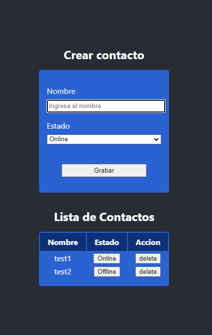

# Ejercicios sesiones 7, 8 y 9

En este ejercicio de React JS deberéis crear una lista, esta lista tendrá dentro distintos contactos y deberá cumplir con las siguientes funcionalidades:

    - Mostrar contacto.

    - Crear contacto.

    - Eliminar contacto.

    - Cambiar el estado del contacto entre Conectado y Desconectado.
___

## Como Usar

<!-- Example: -->


```bash
# Clone this repository
$ git clone git@github.com:hroddev/react-basic-ejercicio7-8-9

# Install dependencies
$ npm install

# Run the app
$ npm start
```